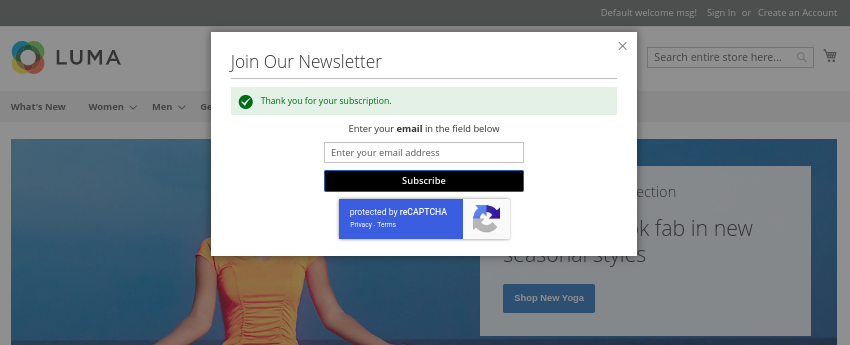
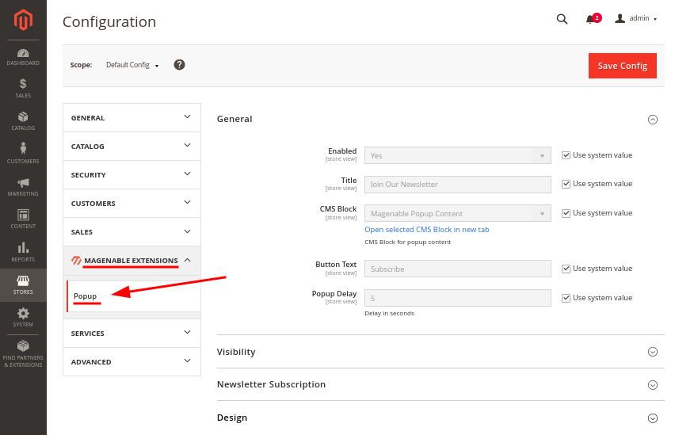

# Magenable Popup

**Magenable Popup** is a Magento 2/Adobe Commerce module that adds a popup to website pages. The content for the popup is sourced from a selected CMS Block. Additionally, the module offers the option to include a newsletter subscription feature in the popup window. Google ReCaptcha v2 and v3 are supported.



## Installation

### Composer:

Run the following command in Magento 2 root folder

```
composer require magenable/module-popup
bin/magento setup:upgrade
bin/magento setup:di:compile
bin/magento setup:static-content:deploy
```
## Upgrade

### Composer:

Run the following command in Magento 2 root folder

```
composer update magenable/module-popup
bin/magento setup:upgrade
bin/magento setup:di:compile
bin/magento setup:static-content:deploy
```

## User Guide

### Configuration:

Go to **Stores** > **Settings** > **Configuration** > **Magenable Extensions** > **Popup**.

#### General

- `Enabled` - Enable or Disable the popup
- `Title` - Title of the popup
- `CMS Block` - You can select a CMS Block for the popup content
- `Button Text` - Newsletter subscription button text
- `Popup Delay` - You can specify number of seconds when popup should arise

#### Visibility

- `Visibility Type` - Choose to show the popup on all pages, excluding specified pages, or only show the popup on specified pages
- `Pages` - Specify the URLs of the pages (without the base URL) based on the previous configuration

#### Newsletter Subscription

- `Add Newsletter Subscription Form` - You can add a newsletter subscription form to the popup

#### Design

- `Max Width of Popup` - Max width of popup in pixels
- `Button Text Color` - Newsletter subscription button color
- `Button Background` - Newsletter subscription button background



**Note:** _Magento Google Recaptha implementation has a bug that breaks a big rendering aroun Newsletter box. It affects alignment of Newsletter pop-up._

#### Compatibility
Tested with Magento Open Source 2.4.5-2.4.6, but will probably work with older Magento 2.X versions and Adobe Commerce

#### About developer
The extension is developed by Magenable (https://magenable.com.au), eCommerce consultancy specializing in Magento/Adobe Commerce based in Melbourne, Australia
